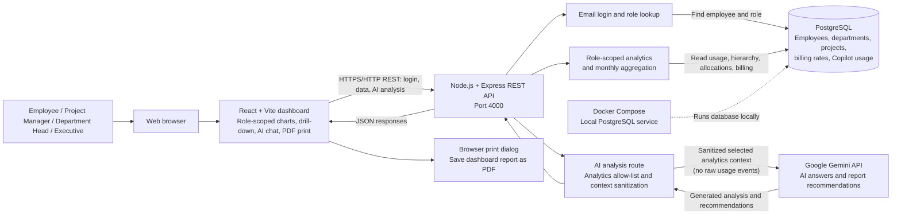

# Solution Architecture

## Request and data flow

1. A user signs in with an employee email. The API looks up the employee and returns the role used to select dashboard views.
2. The frontend requests the selected month’s role-scoped data from the API. The backend reads the PostgreSQL hierarchy, allocations, model billing rates, and Copilot usage, then returns analytics for the dashboard.
3. For AI analysis or an AI-generated PDF report, the frontend sends the relevant aggregated analytics to the AI route. The backend verifies the user exists and sanitizes the context before calling Gemini; it does not send raw usage events or provide Gemini with database access.
4. The dashboard presents the returned analysis. The report expands carousel content and uses the browser print dialog so the user can save the report as a PDF.

## Prototype boundaries

- Docker Compose is the documented local PostgreSQL runtime; the frontend and API are started separately with npm.
- Login currently uses email only and the API accepts a client-supplied user ID. Production use requires authenticated sessions or SSO and server-enforced authorization.
- Model costs are estimates based on blended per-model rates, not invoice values.
