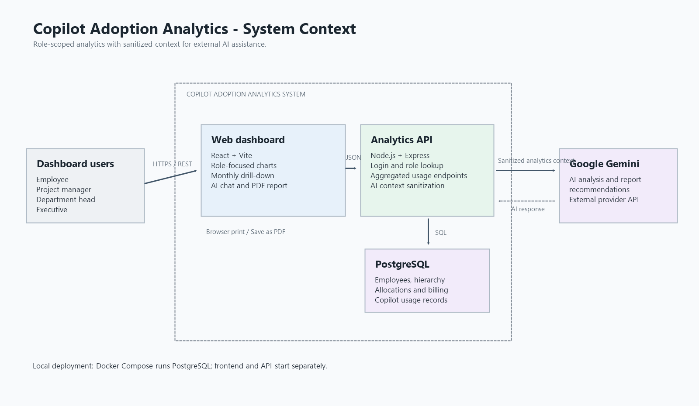

# Solution Architecture

## Overview

Copilot Adoption Analytics is a web application prototype for reviewing GitHub Copilot usage, token allocation, and estimated model API costs. Employees, project managers, department heads, and executives use a React dashboard to view analytics scoped to their role. A Node.js/Express API retrieves and aggregates application data from PostgreSQL. When requested, the API sends a sanitized analytics context to Google Gemini for analysis and report recommendations. PDF export is performed by the browser's print dialog.

This document describes the implemented prototype and distinguishes current behavior from production recommendations. It is linked from the project [README](../../README.md).

## Context Diagram

The system boundary contains the frontend and API. PostgreSQL stores the dashboard's application data. Gemini is an external integration used only for user-requested AI analysis. The frontend sends the API user identifier and selected analytics; the AI route verifies that the identifier refers to an employee and removes analytics fields outside its allow-list before calling Gemini. Gemini is not given database credentials or direct database access.

## Components

| Component | Responsibility | Technology / interface |
|---|---|---|
| Dashboard | Login form, role-focused charts and tables, monthly selector, drill-down, AI chat, report generation | React, Vite, React Router, Bootstrap, Chart.js |
| REST API | Login lookup, role-scoped data endpoints, request validation, analytics aggregation, AI request handling | Node.js, Express, JSON over HTTP |
| Analytics/data layer | Queries employees, roles, hierarchy, token allocations, usage, model rates, and monthly summaries | PostgreSQL via `pg` |
| AI analysis route | Validates AI request shape, verifies user exists, sanitizes context, invokes Gemini, and returns generated text | Express route, `@google/genai` |
| PostgreSQL | Stores employees, departments, projects, billing rates, and Copilot usage events | PostgreSQL; schema and seed scripts |
| Gemini API | Produces answers and report summaries/recommendations from supplied analytics context | Google Gemini API; configured model |
| Browser PDF flow | Expands carousel content for print and opens browser print-to-PDF | Browser print API and print CSS |
| Local runtime | Runs PostgreSQL in a persistent local container | Docker Compose |

The browser and backend are separate processes in the local development setup. Docker Compose runs PostgreSQL; it does not currently containerize the frontend or API.

## Data Flow

1. **Sign in:** the user submits an email to `POST /api/auth/login`. The API looks up the employee and returns an ID, name, email, and role. The prototype stores that user object in browser local storage.
2. **Load analytics:** the frontend requests `GET /api/data` with a `user_id` and selected month. The backend queries PostgreSQL and returns role-specific monthly aggregates and related hierarchy data.
3. **Drill down:** the frontend calls the department or project detail endpoint with a user ID, target ID, and optional month. The API checks the supplied user's role and relevant department/project relationship before returning detail data.
4. **Ask AI / generate AI report:** the frontend sends a question, selected month, user ID, conversation history (for chat), and analytics context to `POST /api/ai/analyze`. The backend validates the request, checks the user exists, sanitizes the analytics context, and sends the resulting prompt to Gemini. It returns Gemini's answer to the frontend. AI report generation waits for this response before opening print.
5. **Print report:** the frontend expands all carousel slides, applies print styles, and invokes the browser print dialog. The user chooses the browser's save-as-PDF option; no server-side PDF service is used.

## Integration and API

All application endpoints are mounted below `/api`. Responses use JSON.

| Method and path | Purpose | Important inputs |
|---|---|---|
| `GET /api/health` | API process health response | None |
| `POST /api/auth/login` | Look up an employee by email | JSON `{ "email": "..." }` |
| `GET /api/data` | Return monthly analytics for a role | `user_id`; optional `month=YYYY-MM` or date range parameters |
| `GET /api/data/departments/:departmentId` | Executive department detail | `user_id`, `departmentId`; optional `month=YYYY-MM` |
| `GET /api/data/projects/:projectId` | Authorized project detail | `user_id`, `projectId`; optional `month=YYYY-MM` |
| `POST /api/ai/analyze` | Ask Gemini about supplied analytics | JSON `userId`, `question`, `analytics`; optional `month`, `history` |

The dashboard sends requests to `http://localhost:4000` by default. The backend allows local frontend origins on ports 5173 and 4173 by default; set `FRONTEND_ORIGINS` to a comma-separated allow-list for another deployment origin.

The AI integration requires `GEMINI_API_KEY`; `GEMINI_MODEL` selects the model. The API enforces question, history, analytics-context, and JSON-body size limits and reports missing configuration or provider failures explicitly. Gemini receives selected sanitized aggregate context, not raw database events. The AI route's existence check is not authentication: the client supplies `userId`.

PostgreSQL connection settings can use `DATABASE_URL` or the `DB_HOST`, `DB_PORT`, `DB_NAME`, `DB_USER`, and `DB_PASSWORD` variables. The local Compose setup maps host port 5433 to PostgreSQL's container port 5432.

## Security and Privacy

### Current prototype controls

- The AI route applies an analytics-key allow-list, string/collection/depth limits, and an overall context size limit before calling the model.
- The AI route does not grant Gemini database access and does not send raw usage-event rows in its AI context.
- The Express API restricts browser CORS origins and caps JSON request bodies.
- Gemini and database configuration are read by the backend from environment variables; the Gemini key should never be bundled into frontend assets.
- AI provider failures are surfaced to the client; provider diagnostics redact API-key-like strings before logging.

### Limitations and production requirements

- Login is email-only; there is no password, SSO, authenticated session, or signed access token.
- The browser supplies `user_id`/`userId`. Some detail routes enforce role and relationship checks, but the main data and AI flows do not establish a trusted authenticated identity. Do not expose this prototype to untrusted networks or use its client-supplied identity as a production authorization boundary.
- Add SSO or another secure authentication method, server-side session/token validation, and authorization derived exclusively from the authenticated principal before production use.
- Configure TLS at the application ingress, use managed secrets rather than committed environment files, rotate credentials, restrict database network access, and define backup/retention policies.
- Add rate limits, abuse detection, audit events, and monitoring for login, analytics, and AI endpoints. Review logs because successful AI answers are logged.
- Apply data minimization and organizational approval to analytics shared with Google Gemini. Review the applicable provider terms, retention configuration, and data-processing requirements before sending business data.
- Model-cost figures are blended-rate estimates, not invoices; do not use them as audited financial records.

## Responsible AI

- **Grounding:** the analysis prompt directs Gemini to use the supplied analytics only, identify missing evidence, and avoid inventing metrics or causes.
- **Data minimization:** only the selected aggregate analytics context is sanitized and sent; raw usage events and database access are excluded.
- **Human decision-making:** generated summaries and reallocation/cost recommendations are advisory. A manager should validate the source metrics, business context, and any proposed change before acting.
- **Uncertainty and cost:** AI recommendations may be incorrect or incomplete. Model-cost inputs are estimates based on blended per-model rates and available token totals; they are not exact invoices or guaranteed savings.
- **Oversight:** review generated reports for accuracy and appropriateness before sharing. Do not use the prototype as the sole basis for employee evaluation, disciplinary decisions, or access decisions.
- **Failure behavior:** if AI configuration or the provider is unavailable, report generation displays an error rather than substituting fabricated or success-shaped recommendations.

## Deployment

### Environments

| Environment | Intended configuration |
|---|---|
| Local development | Docker Compose PostgreSQL; backend and Vite development server run separately with npm |
| Staging / production target | Separately deployed frontend static assets, Node.js API service, managed PostgreSQL, and controlled outbound Gemini API access. This is a deployment target, not an included deployment manifest. |

Use separate databases, API keys, CORS origins, and access policies for each environment. Do not reuse the example local PostgreSQL credentials in a hosted environment.

### Local deployment steps

The repository README documents the intended submission layout (`docker-compose.yaml` at repository root and application folders under `src`). From the repository root:

1. Start the database with `docker compose up -d postgres`.
2. Load `src/backend/db/schema.sql` and the ordered `src/backend/db/seeds/00_run_all.sql` seed set into the database.
3. Configure `src/backend/.env` with database connection variables and, if AI features are enabled, `GEMINI_API_KEY` and `GEMINI_MODEL`.
4. From `src/backend`, install dependencies with `npm install` and start the API with `npm start`. Confirm `GET /api/health` responds.
5. From `src/frontend`, install dependencies with `npm install` and start Vite with `npm run dev`.
6. Sign in with an email in the seeded employee data. Test role-scoped analytics, drill-down, and AI functionality only when a valid Gemini key is configured.

Consult the [README setup guide](../../README.md#setup-and-execution) for the PowerShell commands and seed-loading details.

### Hosted deployment steps

No hosted deployment, infrastructure-as-code, CI/CD, or container image configuration is included. A production deployment would typically:

1. Prepare an isolated PostgreSQL instance, apply schema and reviewed migrations, and import approved data using a least-privilege database role.
2. Build the frontend using `npm run build` in `src/frontend` and publish its static output to an HTTPS-enabled web host or CDN.
3. Deploy the backend as a Node.js 18+ service; configure `PORT`, database connection settings, `FRONTEND_ORIGINS`, `GEMINI_API_KEY`, and `GEMINI_MODEL` through the hosting provider's secret/configuration facility.
4. Restrict ingress and database access, configure TLS, health checks, backups, logs, and alerting; allow outbound access to the Gemini API only as required.
5. Configure the browser-facing API base URL at frontend build time with `VITE_API_BASE_URL`, then run smoke tests for health, sign-in, role authorization, monthly analytics, AI errors, and report printing.
6. Promote the release only after authentication/authorization hardening, privacy review, operational readiness, and rollback steps have been validated.

### Operational ownership

The prototype does not define named on-call teams or service-level objectives. Before a hosted launch, assign explicit ownership:

- **Product / analytics owner:** metric definitions, allocation policy, report interpretation, and AI recommendation review.
- **Application owner:** frontend/API releases, dependency updates, access controls, incident response, and application monitoring.
- **Database owner:** schema changes, least-privilege access, backups, restore testing, capacity, and retention.
- **AI / privacy owner:** Gemini model and key lifecycle, provider review, prompt/output evaluation, data-minimization policy, and AI incident escalation.
- **Platform / operations owner:** hosting, TLS, secrets management, network policy, CI/CD, availability monitoring, and rollback.

Document escalation contacts, retention periods, backup recovery objectives, and service-level objectives in the deployment environment's operational runbooks.
